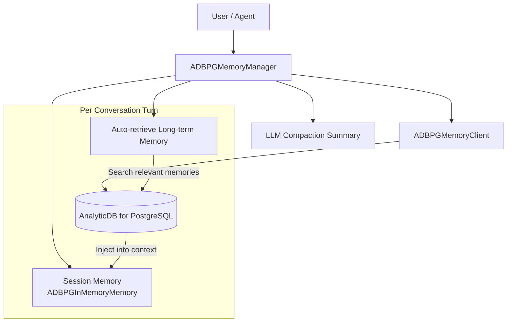
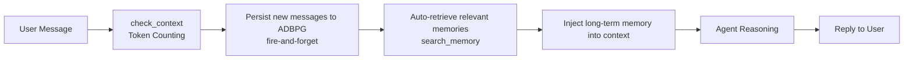
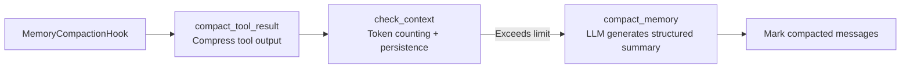

# ADBPG Long-term Memory

**ADBPG Long-term Memory** is an optional memory backend for CoPaw, powered by [AnalyticDB for PostgreSQL](https://www.alibabacloud.com/product/hybriddb-postgresql) (ADBPG). It provides persistent long-term memory across conversations. Compared to the default local memory (ReMeLight), the ADBPG backend stores memories in a cloud database, making it suitable for multi-device memory sharing, large-scale memory storage, and enterprise deployments.

---

## Architecture Overview



ADBPG long-term memory management includes the following capabilities:

| Capability                        | Description                                                                                     |
| --------------------------------- | ----------------------------------------------------------------------------------------------- |
| **Memory Persistence**            | Automatically persists user messages to ADBPG asynchronously on every conversation turn         |
| **Auto-retrieval**                | Automatically searches ADBPG for relevant long-term memories before each conversation turn      |
| **Context Compaction**            | Integrates with the [context management](./context.en.md) mechanism for automatic summarization |
| **Tool Result Compaction**        | Supports LLM summarization and truncation modes for compressing verbose tool outputs            |
| **Memory Search Tool**            | Provides a `memory_search` tool combining ADBPG semantic search and local file keyword matching |
| **Multi-Agent Memory Management** | Supports both memory isolation and memory sharing modes between agents                          |

---

## Workflow

### Memory Flow Per Conversation Turn



1. **Persistence**: New user messages from each turn are automatically written to ADBPG asynchronously (fire-and-forget, non-blocking)
2. **Auto-retrieval**: Uses the latest user message as a query to search ADBPG for relevant memory snippets (returns 3 by default)
3. **Context injection**: Retrieved memories are automatically injected into the session context, enhancing LLM call quality

### Context Compaction Flow

The ADBPG backend is fully compatible with the [context management](./context.en.md) mechanism:



- `compact_tool_result` supports `summarize` (LLM summary) and `truncate` modes, configured via the `tool_compact_mode` field in the console UI
- `compact_memory` uses an LLM to generate structured summaries (same format as local memory), supporting both Chinese and English
- Compaction summaries are stored in session memory, not written to ADBPG (ADBPG only stores raw user messages)

---

## Configuration

In the console's **Agent Config** page, find the **Memory Manager** card:

1. Switch **Backend** to `Memory Manager (ADBPG)`
2. Fill in the database connection, LLM, and Embedding configuration
3. Adjust optional settings as needed (connection pool size, tool output compaction mode, etc.)
4. Click **Save**

The configuration is written to the `memory_manager` field in `agent.json`:

```json
{
  "memory_manager": {
    "backend": "adbpg",
    "adbpg": {
      "host": "gp-xxx.gpdb.rds.aliyuncs.com",
      "port": 5432,
      "user": "your_user",
      "password": "your_password",
      "dbname": "your_db",
      "llm_model": "qwen-plus",
      "llm_api_key": "sk-xxx",
      "llm_base_url": "https://dashscope.aliyuncs.com/compatible-mode/v1",
      "embedding_model": "text-embedding-v3",
      "embedding_api_key": "sk-xxx",
      "embedding_base_url": "https://dashscope.aliyuncs.com/compatible-mode/v1",
      "embedding_dims": 1024,
      "hnsw": null,
      "search_timeout": 10.0,
      "pool_minconn": 2,
      "pool_maxconn": 10,
      "tool_compact_mode": "summarize",
      "tool_compact_max_len": 500,
      "memory_isolation": false
    }
  }
}
```

Field reference:

| Field                  | Description                                                                                                       | Required | Default             |
| ---------------------- | ----------------------------------------------------------------------------------------------------------------- | -------- | ------------------- |
| `host`                 | Database host address                                                                                             | Yes      | —                   |
| `port`                 | Database port                                                                                                     | Yes      | —                   |
| `user`                 | Database username                                                                                                 | Yes      | —                   |
| `password`             | Database password                                                                                                 | Yes      | —                   |
| `dbname`               | Database name                                                                                                     | Yes      | —                   |
| `llm_model`            | LLM model name                                                                                                    | Yes      | —                   |
| `llm_api_key`          | LLM API key                                                                                                       | Yes      | —                   |
| `llm_base_url`         | LLM base URL                                                                                                      | Yes      | —                   |
| `embedding_model`      | Embedding model name                                                                                              | No       | `text-embedding-v3` |
| `embedding_api_key`    | Embedding API key                                                                                                 | Yes      | —                   |
| `embedding_base_url`   | Embedding base URL                                                                                                | Yes      | —                   |
| `embedding_dims`       | Embedding vector dimensions                                                                                       | No       | `1024`              |
| `hnsw`                 | HNSW index configuration                                                                                          | No       | None                |
| `search_timeout`       | Memory search timeout (seconds)                                                                                   | No       | `10.0`              |
| `pool_minconn`         | Connection pool minimum connections                                                                               | No       | `2`                 |
| `pool_maxconn`         | Connection pool maximum connections                                                                               | No       | `10`                |
| `tool_compact_mode`    | Tool output compaction mode: `summarize` / `truncate`                                                             | No       | `summarize`         |
| `tool_compact_max_len` | Max length after tool output compaction (chars)                                                                   | No       | `500`               |
| `memory_isolation`     | Memory isolation toggle. When off, all agents share memory; when on, each agent's memory is isolated via agent_id | No       | `false`             |

---

## Searching Memory

The Agent can search memories using the `memory_search` tool, which combines results from two sources:

1. ADBPG database semantic search (via `adbpg_llm_memory.search()`)
2. Local `MEMORY.md` and `memory/*.md` file keyword matching

ADBPG results are shown first (higher semantic relevance), followed by local file matches, capped at `max_results`.

```
memory_search(query="previous discussion about deployment process", max_results=5)
```

| Parameter     | Description                                 | Default  |
| ------------- | ------------------------------------------- | -------- |
| `query`       | Search query text                           | Required |
| `max_results` | Maximum number of results                   | `5`      |
| `min_score`   | Minimum relevance score cutoff (ADBPG only) | `0.1`    |

Example output:

```
[1] (adbpg, score: 0.85)
User discussed using Docker Compose for deployment

[2] (adbpg, score: 0.72)
Decided to use Nginx as a reverse proxy

[3] (file: MEMORY.md)
## Deployment Plan
Using Docker Compose for orchestration, Nginx as reverse proxy, SSL via Let's Encrypt.
```

---

## Fault Tolerance

The ADBPG backend is designed with multiple layers of fault tolerance, ensuring the Agent continues to work even when the database is unavailable:

| Scenario                 | Behavior                                                                               |
| ------------------------ | -------------------------------------------------------------------------------------- |
| Incomplete ADBPG config  | Prints a warning at startup; long-term memory disabled; Agent uses session memory only |
| ADBPG connection failure | Prints a warning at startup; `_client` set to `None`; Agent runs normally              |
| Memory write failure     | Background thread catches the exception and logs it; main conversation flow unaffected |
| Memory search timeout    | Returns empty results; prints a warning log; Agent continues reasoning                 |
| Auto-retrieval failure   | Catches the exception and logs it; Agent continues with session memory context         |

---

## Multi-Agent Support

ADBPG Memory Manager fully supports CoPaw's [multi-agent architecture](./multi-agent.en.md). Each Agent has its own `ADBPGMemoryManager` instance and can be configured independently via the console UI.

### Independent Configuration

When you switch between Agents in the console, each Agent's **Agent Config → Memory Manager** card is independent:

- Agent A can use the ADBPG backend while Agent B uses the local ReMeLight backend
- Multiple ADBPG-backed Agents can connect to different database instances or use different LLM / Embedding configurations
- Configuration is stored in each Agent's own `agent.json` and does not interfere with other Agents

### Memory Sharing vs. Isolation

When multiple Agents connect to the same ADBPG database, the `memory_isolation` toggle controls whether their long-term memories are shared or isolated:

| Mode             | `memory_isolation` | Behavior                                                                                                       |
| ---------------- | ------------------ | -------------------------------------------------------------------------------------------------------------- |
| Shared (default) | `false`            | All Agents use the same `agent_id` (`"shared"`) when accessing ADBPG, so long-term memories are visible to all |
| Isolated         | `true`             | Each Agent uses its own real `agent_id` when accessing ADBPG, so memories are fully isolated                   |

The toggle is available in the **Optional Configuration** section of the console and takes effect immediately after saving (hot-reload, no restart required).

## Prerequisites

1. **ADBPG instance**: An accessible AnalyticDB for PostgreSQL instance with the `adbpg_llm_memory` extension installed
2. **LLM service**: For memory compaction and summary generation (e.g., Qwen / OpenAI-compatible API)

---

## Related Pages

- [Long-term Memory](./memory.en.md) — Local memory backend (ReMeLight) details
- [Context Management](./context.en.md) — Context compaction mechanism
- [Configuration & Working Directory](./config.en.md) — Working directory and config
- [Multi-Agent](./multi-agent.en.md) — Multi-Agent architecture
