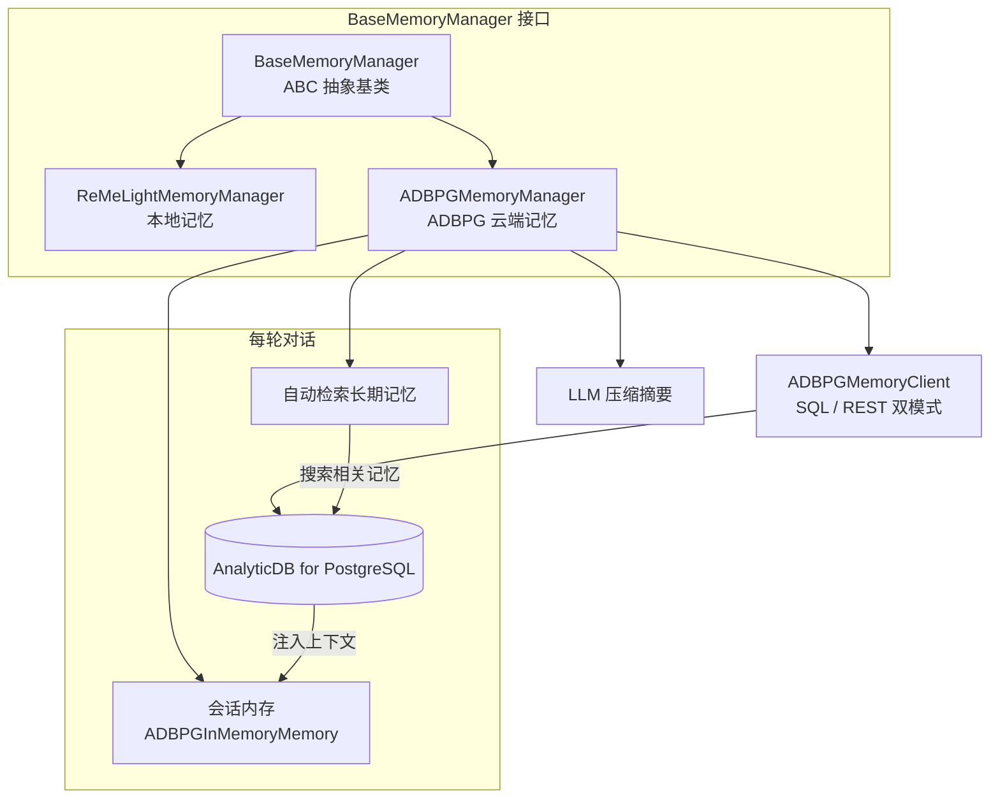
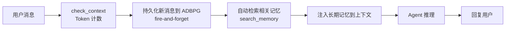
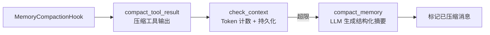

# ADBPG 长期记忆

**ADBPG 长期记忆** 是 CoPaw 的一种可选记忆后端，基于 [AnalyticDB for PostgreSQL](https://www.alibabacloud.com/product/hybriddb-postgresql)（简称 ADBPG）实现跨会话的持久化长期记忆。与默认的本地记忆（ReMeLight）相比，ADBPG 后端将记忆存储在云端数据库中，适合需要多设备共享记忆、大规模记忆存储或企业级部署的场景。

`ADBPGMemoryManager` 实现了 CoPaw 的 `BaseMemoryManager` 抽象基类接口，与 `ReMeLightMemoryManager` 完全平级、可互换。通过 `AgentsRunningConfig` 中的 `memory_manager_backend` 字段即可在两种后端之间切换，无需修改任何业务代码。

---

## 架构概览



ADBPG 长期记忆管理包含以下能力：

| 能力                 | 说明                                                                                       |
| -------------------- | ------------------------------------------------------------------------------------------ |
| **记忆持久化**       | 每轮对话自动将用户消息异步写入 ADBPG，无需手动操作                                         |
| **自动检索**         | 每轮对话前自动搜索 ADBPG 中的相关长期记忆，注入到当前上下文                                |
| **上下文压缩**       | 与[上下文管理](./context.zh.md)机制集成，超限时自动生成结构化摘要                          |
| **工具结果压缩**     | 支持 LLM 摘要和截断两种模式压缩超长工具输出                                                |
| **记忆搜索工具**     | 提供 `memory_search` 工具，Agent 可主动搜索长期记忆（ADBPG 语义搜索 + 本地文件关键词匹配） |
| **多智能体记忆管理** | 支持多智能体之间记忆隔离、记忆共享两种模式                                                 |

---

## 工作流程

### 每轮对话的记忆流转



1. **持久化**：每轮对话中的新用户消息自动异步写入 ADBPG（fire-and-forget，不阻塞主流程）
2. **自动检索**：以最新用户消息为查询，搜索 ADBPG 中的相关记忆片段（默认返回 3 条）
3. **注入上下文**：检索到的记忆自动注入到会话上下文，增强LLM调用质量

### 上下文压缩流程

ADBPG 后端与[上下文管理](./context.zh.md)机制完全兼容，压缩流程如下：



- `compact_tool_result` 支持 `summarize`（LLM 摘要）和 `truncate`（截断）两种模式，通过控制台 UI 的 `tool_compact_mode` 字段配置
- `compact_memory` 使用 LLM 生成结构化摘要（与本地记忆格式一致），支持中英文
- 压缩摘要存储在会话内存中，不写入 ADBPG（ADBPG 只存储原始用户消息）

---

## 配置

在控制台的 **Agent Config** 页面，找到 **Memory Manager** 卡片：

1. 将 **Backend** 切换为 `Memory Manager (ADBPG)`
2. 填写数据库连接、LLM、Embedding 配置
3. 根据需要调整可选配置（连接池大小、工具输出压缩模式等）
4. 点击 **Save** 保存

配置会写入 `agent.json` 的 `running` 字段（即 `AgentsRunningConfig`）：

```json
{
  "running": {
    "memory_manager_backend": "adbpg",
    "adbpg": {
      "host": "gp-xxx.gpdb.rds.aliyuncs.com",
      "port": 5432,
      "user": "your_user",
      "password": "your_password",
      "dbname": "your_db",
      "llm_model": "qwen-plus",
      "llm_api_key": "sk-xxx",
      "llm_base_url": "https://dashscope.aliyuncs.com/compatible-mode/v1",
      "embedding_model": "text-embedding-v3",
      "embedding_api_key": "sk-xxx",
      "embedding_base_url": "https://dashscope.aliyuncs.com/compatible-mode/v1",
      "embedding_dims": 1024
    },
    "strip_local_memory_instructions": false
  }
}
```

各字段说明：

| 字段                   | 说明                                                                           | 必填 | 默认值              |
| ---------------------- | ------------------------------------------------------------------------------ | ---- | ------------------- |
| `host`                 | 数据库主机地址                                                                 | 是   | —                   |
| `port`                 | 数据库端口                                                                     | 是   | —                   |
| `user`                 | 数据库用户名                                                                   | 是   | —                   |
| `password`             | 数据库密码                                                                     | 是   | —                   |
| `dbname`               | 数据库名称                                                                     | 是   | —                   |
| `llm_model`            | LLM 模型名称                                                                   | 是   | —                   |
| `llm_api_key`          | LLM API Key                                                                    | 是   | —                   |
| `llm_base_url`         | LLM Base URL                                                                   | 是   | —                   |
| `embedding_model`      | Embedding 模型名称                                                             | 否   | `text-embedding-v3` |
| `embedding_api_key`    | Embedding API Key                                                              | 是   | —                   |
| `embedding_base_url`   | Embedding Base URL                                                             | 是   | —                   |
| `embedding_dims`       | Embedding 向量维度                                                             | 否   | `1024`              |
| `hnsw`                 | HNSW 索引配置                                                                  | 否   | 无                  |
| `search_timeout`       | 记忆搜索超时（秒）                                                             | 否   | `10.0`              |
| `pool_minconn`         | 连接池最小连接数                                                               | 否   | `2`                 |
| `pool_maxconn`         | 连接池最大连接数                                                               | 否   | `10`                |
| `tool_compact_mode`    | 工具输出压缩模式：`summarize` / `truncate`                                     | 否   | `summarize`         |
| `tool_compact_max_len` | 工具输出压缩后最大长度（字符）                                                 | 否   | `500`               |
| `memory_isolation`     | 记忆隔离开关。关闭时所有 Agent 共享记忆；开启后各 Agent 记忆通过 agent_id 隔离 | 否   | `false`             |

此外，`running` 中还有以下与 ADBPG 相关的顶层字段：

| 字段                              | 说明                                                                   | 必填 | 默认值      |
| --------------------------------- | ---------------------------------------------------------------------- | ---- | ----------- |
| `memory_manager_backend`          | 记忆后端类型：`remelight`（本地）或 `adbpg`（云端）                    | 否   | `remelight` |
| `strip_local_memory_instructions` | 是否从 AGENTS.md 中移除本地记忆相关指令（切换到 ADBPG 后端时建议开启） | 否   | `false`     |

---

## 搜索记忆

Agent 可以通过 `memory_search` 工具搜索记忆，结果来自两个来源：

1. ADBPG 数据库语义搜索（通过 `adbpg_llm_memory.search()`）
2. 本地 `MEMORY.md` 和 `memory/*.md` 文件关键词匹配

ADBPG 结果优先展示（语义相关性更高），本地文件结果作为补充，合并后按 `max_results` 截取。

```
memory_search(query="之前关于部署流程的讨论", max_results=5)
```

| 参数          | 说明                                | 默认值 |
| ------------- | ----------------------------------- | ------ |
| `query`       | 搜索查询文本                        | 必填   |
| `max_results` | 最大返回结果数                      | `5`    |
| `min_score`   | 最低相关性分数阈值（仅 ADBPG 结果） | `0.1`  |

返回结果示例：

```
[1] (adbpg, score: 0.85)
用户讨论了使用 Docker Compose 进行部署的方案

[2] (adbpg, score: 0.72)
决定使用 Nginx 作为反向代理

[3] (file: MEMORY.md)
## 部署方案
采用 Docker Compose 编排，Nginx 反向代理，SSL 由 Let's Encrypt 提供。
```

---

## 容错机制

ADBPG 后端设计了多层容错，确保数据库不可用时 Agent 仍能正常工作：

| 场景             | 行为                                                   |
| ---------------- | ------------------------------------------------------ |
| ADBPG 配置不完整 | 启动时打印警告，长期记忆功能禁用，Agent 仅使用会话内存 |
| ADBPG 连接失败   | 启动时打印警告，`_client` 设为 `None`，Agent 正常运行  |
| 记忆写入失败     | 后台线程捕获异常并记录日志，不影响主对话流程           |
| 记忆搜索超时     | 返回空结果，打印警告日志，Agent 继续推理               |
| 自动检索失败     | 捕获异常并记录日志，Agent 继续使用会话内存中的上下文   |

---

## 多 Agent 支持

ADBPG Memory Manager 完整支持 CoPaw 的[多 Agent 架构](./multi-agent.zh.md)。每个 Agent 拥有独立的 `ADBPGMemoryManager` 实例，可以在控制台页面上分别配置不同的记忆后端和参数，互不影响。

### 独立配置

在控制台切换到不同 Agent 后，各自的 **Agent Config → Memory Manager** 卡片是独立的：

- Agent A 可以使用 ADBPG 后端，Agent B 可以使用本地 ReMeLight 后端
- 使用 ADBPG 的多个 Agent 可以连接不同的数据库实例，或使用不同的 LLM / Embedding 配置
- 配置保存在各 Agent 自己的 `agent.json` 中，互不干扰

### 记忆共享与隔离

当多个 Agent 连接同一个 ADBPG 数据库时，可以通过 `memory_isolation` 开关控制记忆的共享与隔离：

| 模式         | `memory_isolation` | 行为                                                                   |
| ------------ | ------------------ | ---------------------------------------------------------------------- |
| 共享（默认） | `false`            | 所有 Agent 使用相同的 `agent_id`（`"shared"`）访问 ADBPG，长期记忆互通 |
| 隔离         | `true`             | 每个 Agent 使用自己的真实 `agent_id` 访问 ADBPG，记忆完全隔离          |

该开关可在控制台的 **Optional Configuration** 区域中切换，无需重启即可生效（保存后自动热重载）。

## 前置条件

1. **ADBPG 实例**：需要一个可访问的 AnalyticDB for PostgreSQL 实例，并已安装 `adbpg_llm_memory` 扩展
2. **LLM 服务**：用于记忆压缩和摘要生成（如通义千问 / OpenAI 兼容接口）

---

## 相关页面

- [长期记忆](./memory.zh.md) — 本地记忆后端（ReMeLight）的详细说明
- [上下文管理](./context.zh.md) — 上下文压缩机制
- [配置与工作目录](./config.zh.md) — 工作目录与 config
- [多 Agent](./multi-agent.zh.md) — 多 Agent 架构
